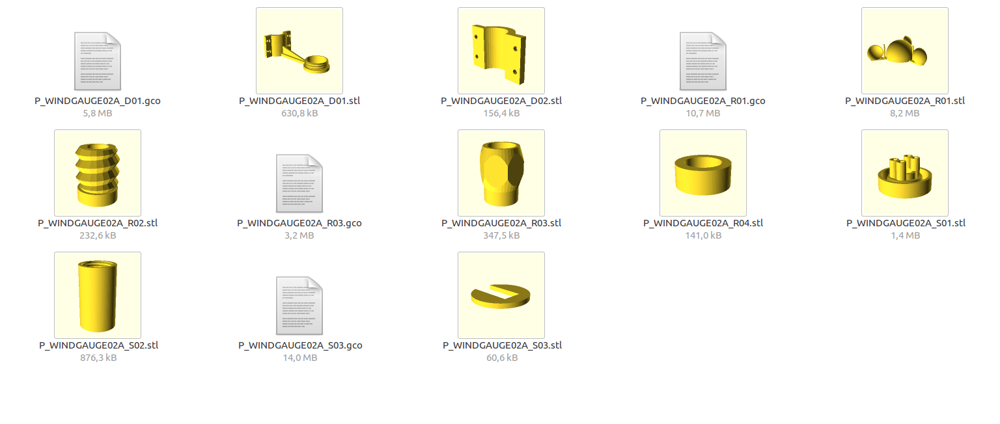

# stl-thumbnailer
Shows thumbnails of STL files in Nautilus file browser. The sources are based on [linux nautilus stl thumbnailer :)](http://www.thingiverse.com/thing:258653)

## Install

### Install OpenSCAD

This project use [OpenSCAD](http://www.openscad.org/) for thumbnails preview. You must install OpenSCAD before using it.

### Install stl-thumbnailer

clone from repository

    git clone https://github.com/MLAB-project/stl-thumbnailer.git
    cd stl-thumbnailer

    sudo cp stl_thumb.py /usr/local/bin/
    sudo chmod a+x /usr/local/bin/stl_thumb.py
    sudo cp stl.thumbnailer /usr/share/thumbnailers/
    cp stl.xml ~/.local/share/mime/packages/

(note that it's also possible to keep files in the current dir, and only make symlinks. In that case, you'll have to edit `stl.thumbnailer` file and adapt the `Exec=` line to make it point to actual directory)

After that you should update MIME database by runnig following commands:
(adapt to your Linux distribution)

  - update mime database :

        update-mime-database ~/.local/share/mime/
        sudo update-mime

  - clear thumbnails cache :

        rm -rf ~/.cache/thumbnails/*

  - refresh (F5 or crtl-r) Nautilus showing a folder containing some stl files

Now the STL thumbnails should show-up. If not, you can try:

  - close Nautilus :

        killall nautilus

  - and start it again
  - in last hope, you can try to log out and login to the desktop

### Thumbnails preview from OpenSCAD files

If you looking for an preview generated from .scad files you could check [OpenSCAD Thumbnailer for Gnome](http://srlm.io/2015/12/15/scad-thumbnailer/) but computing power required for rendering more complicated scad model could be prohibitive to use this approach.
